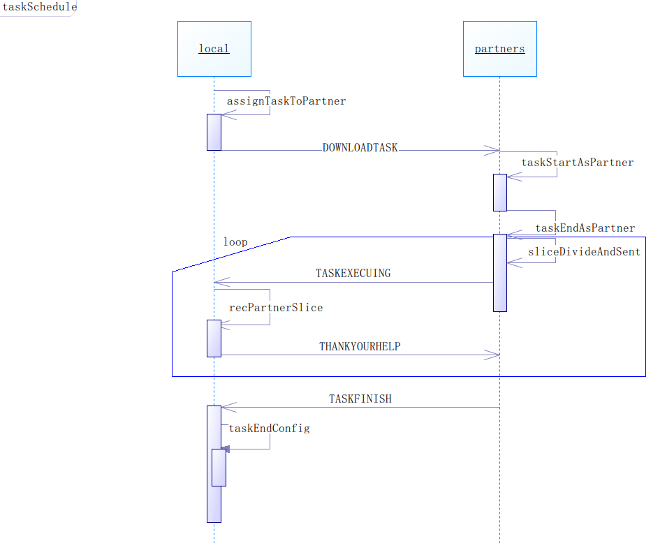
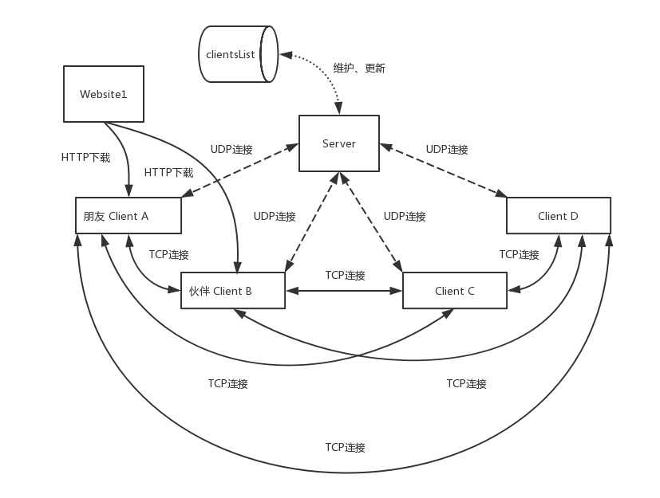
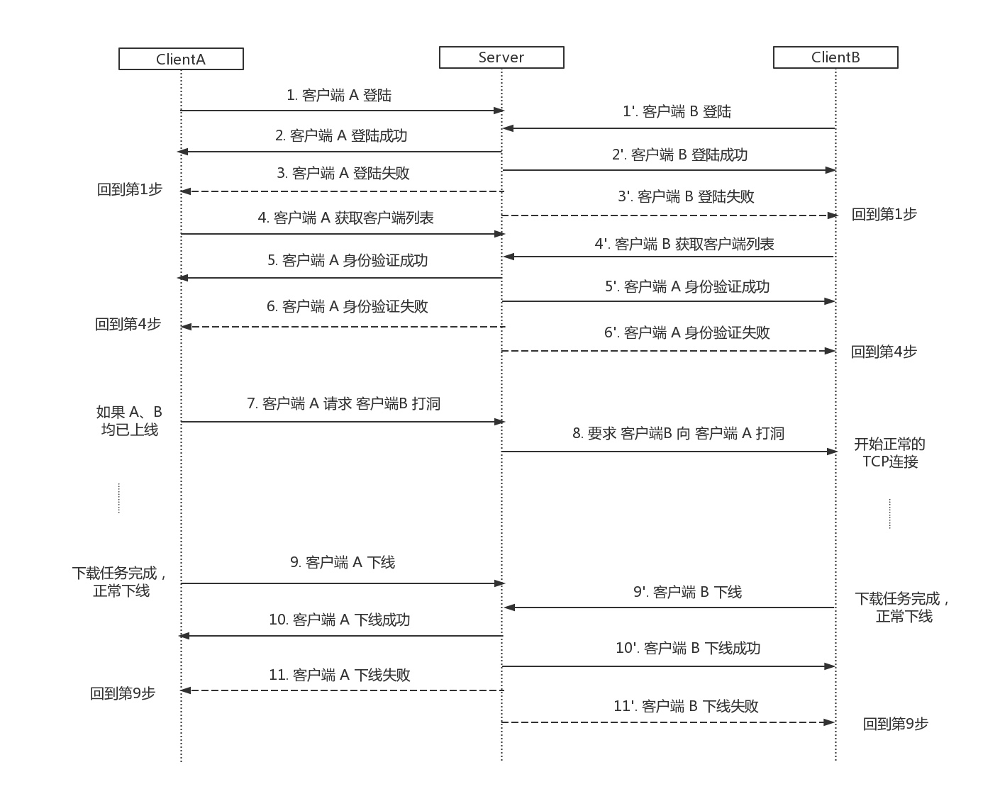
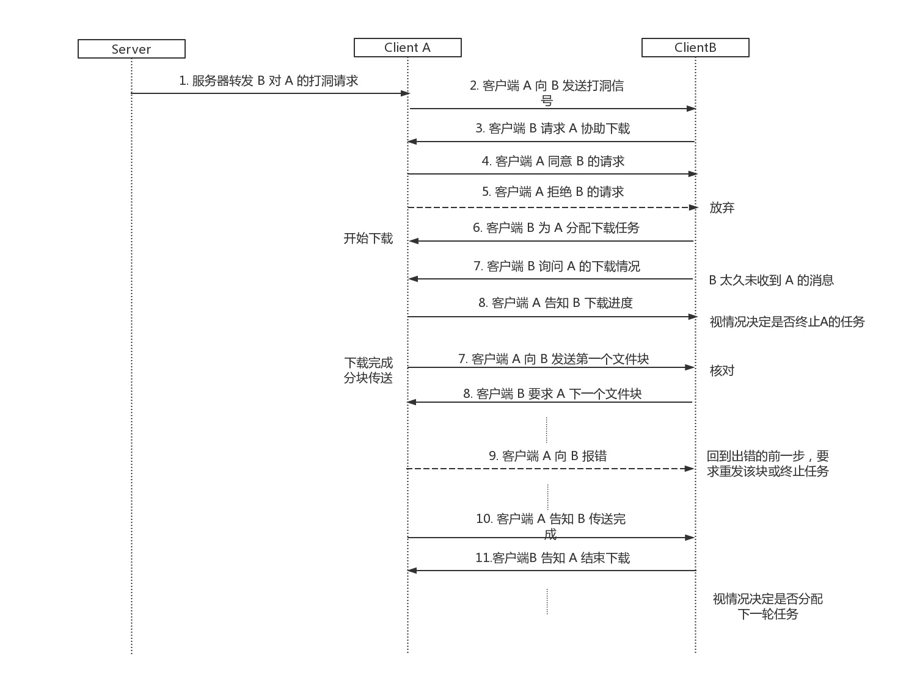

# 目录

<nav>
<a href="#项目简介">项目简介</a><br/>
<br/>
<a href="#系统组成">系统组成</a><br/>
<br/>    
<a href="#工作流程">工作流程</a><br/>
<br/>    
<a href="#模块设计">模块设计</a><br/>    
&nbsp;&nbsp;<a href="##一、控制调度模块">一、控制调度模块</a><br/>
&nbsp;&nbsp;&nbsp;&nbsp;<a href="###11 命名约定">1.1 命名约定</a><br/>
&nbsp;&nbsp;&nbsp;&nbsp;<a href="###12 模块功能概述">1.2 模块功能概述</a><br/>
&nbsp;&nbsp;&nbsp;&nbsp;<a href="###13 实现细节">1.3 实现细节</a><br/>
&nbsp;&nbsp;&nbsp;&nbsp;&nbsp;&nbsp;<a href="####131 模块类图">1.3.1 模块类图</a><br/>
&nbsp;&nbsp;&nbsp;&nbsp;&nbsp;&nbsp;<a href="####132 登录通信">1.3.2 登录通信</a><br/>
&nbsp;&nbsp;&nbsp;&nbsp;&nbsp;&nbsp;<a href="####133 任务分发">1.3.3 任务分发</a><br/>
&nbsp;&nbsp;&nbsp;&nbsp;&nbsp;&nbsp;&nbsp;&nbsp;<a href="####1331 算法流程图">1.3.3.1 算法流程图</a><br/>
&nbsp;&nbsp;&nbsp;&nbsp;&nbsp;&nbsp;&nbsp;&nbsp;<a href="####1332 相关">1.3.3.2 相关</a><br/>
&nbsp;&nbsp;&nbsp;&nbsp;&nbsp;&nbsp;&nbsp;&nbsp;<a href="####1333 初始化">1.3.3.3 初始化</a><br/>
&nbsp;&nbsp;&nbsp;&nbsp;&nbsp;&nbsp;&nbsp;&nbsp;<a href="####1334 任务块队列创建">1.3.3.4 任务块队列创建</a><br/>
&nbsp;&nbsp;&nbsp;&nbsp;&nbsp;&nbsp;&nbsp;&nbsp;<a href="####1335 异常检测">1.3.3.5 异常检测</a><br/>          
&nbsp;&nbsp;&nbsp;&nbsp;&nbsp;&nbsp;<a href="####134 下载通信">1.3.4 下载通信</a><br/>
&nbsp;&nbsp;&nbsp;&nbsp;<a href="###14 UI设计与未来完善">1.4 UI设计与未来完善</a><br/>
<br/>
&nbsp;&nbsp;<a href="##二、HTTP 下载子模块">二、HTTP 下载子模块</a><br/>
&nbsp;&nbsp;&nbsp;&nbsp;<a href="###21 功能">2.1 功能</a><br/>
&nbsp;&nbsp;&nbsp;&nbsp;<a href="###22 特性">2.2 特性</a><br/>
&nbsp;&nbsp;&nbsp;&nbsp;<a href="###23 工作流程">2.3 工作流程</a><br/>
&nbsp;&nbsp;&nbsp;&nbsp;<a href="###24 信号槽关联">2.4 信号槽关联</a><br/>
&nbsp;&nbsp;&nbsp;&nbsp;<a href="###25 具体实现 ">2.5 具体实现 </a><br/>
&nbsp;&nbsp;&nbsp;&nbsp;<a href="###26 测试">2.6 测试</a><br/>
<br/>
&nbsp;&nbsp;<a href="##三、P2P通信子模块">三、P2P通信子模块</a><br/>
&nbsp;&nbsp;&nbsp;&nbsp;<a href="###31 介绍">3.1 介绍</a><br/>
&nbsp;&nbsp;&nbsp;&nbsp;<a href="###32 模块总体架构">3.2 模块总体架构</a><br/>
&nbsp;&nbsp;&nbsp;&nbsp;<a href="###33 服务器和客户端的UDP通信">3.3 服务器和客户端的UDP通信</a><br/>
&nbsp;&nbsp;&nbsp;&nbsp;&nbsp;&nbsp;<a href="####331 控制消息">3.3.1 控制消息</a><br/>
&nbsp;&nbsp;&nbsp;&nbsp;&nbsp;&nbsp;<a href="####332 客户端信息列表的数据结构">3.3.2 客户端信息列表的数据结构</a><br/>
&nbsp;&nbsp;&nbsp;&nbsp;<a href="###34 客户端之间的TCP通信">3.4 客户端之间的TCP通信</a><br/>
&nbsp;&nbsp;&nbsp;&nbsp;&nbsp;&nbsp;<a href="####341 朋友角色对应的TCP连接">3.4.1 朋友角色对应的TCP连接</a><br/>
&nbsp;&nbsp;&nbsp;&nbsp;&nbsp;&nbsp;<a href="####342 伙伴角色对应的TCP连接">3.4.2 伙伴角色对应的TCP连接</a><br/>
&nbsp;&nbsp;&nbsp;&nbsp;&nbsp;&nbsp;<a href="####343 控制消息">3.4.3 控制消息</a><br/>
&nbsp;&nbsp;&nbsp;&nbsp;&nbsp;&nbsp;<a href="####344 下载任务的标识">3.4.4 下载任务的标识</a><br/>
&nbsp;&nbsp;&nbsp;&nbsp;<a href="###35 P2P子模块和主控模块的交互 ">3.5 P2P子模块和主控模块的交互 </a><br/>
&nbsp;&nbsp;&nbsp;&nbsp;<a href="###36 一些困难">3.6 一些困难</a><br/>
&nbsp;&nbsp;&nbsp;&nbsp;&nbsp;&nbsp;<a href="####361 负载过大">3.6.1 负载过大</a><br/>
&nbsp;&nbsp;&nbsp;&nbsp;&nbsp;&nbsp;<a href="####362 指针的管理困难">3.6.2 指针的管理困难</a><br/>
<br/>
<a href="#项目总结">项目总结</a><br/>    
&nbsp;&nbsp;<a href="##一、分工情况">一、分工情况</a><br/>
&nbsp;&nbsp;&nbsp;&nbsp;<a href="###11 负责模块">1.1 负责模块</a><br/>
<br/>    
&nbsp;&nbsp;<a href="##二、个人总结">二、个人总结</a><br/>
&nbsp;&nbsp;&nbsp;&nbsp;<a href="###21 薛国潼">2.1 薛国潼</a><br/>
&nbsp;&nbsp;&nbsp;&nbsp;&nbsp;&nbsp;<a href="####211 优秀的队友">2.1.1 优秀的队友</a><br/>
&nbsp;&nbsp;&nbsp;&nbsp;&nbsp;&nbsp;<a href="####212 软件危机">2.1.2 软件危机</a><br/>
&nbsp;&nbsp;&nbsp;&nbsp;&nbsp;&nbsp;<a href="####213 个人成长">2.1.3 个人成长</a><br/>    
&nbsp;&nbsp;&nbsp;&nbsp;<a href="###22 俞家乐">2.2 俞家乐</a><br/>
&nbsp;&nbsp;&nbsp;&nbsp;<a href="###23 余宗宪">2.3 余宗宪</a><br/>
&nbsp;&nbsp;&nbsp;&nbsp;&nbsp;&nbsp;<a href="####231 集体开发的挑战">2.3.1 集体开发的挑战</a><br/>
&nbsp;&nbsp;&nbsp;&nbsp;&nbsp;&nbsp;<a href="####232 Debug的困难">2.3.2 Debug的困难</a><br/>
&nbsp;&nbsp;&nbsp;&nbsp;&nbsp;&nbsp;<a href="####233 模块的独立性">2.3.3 模块的独立性</a><br/>    
</nav>

# 项目简介

在信息爆炸的现代社会，我们对网络资源的需求日益增长。然而受限于接入网络设备数量过于庞大、文件、应用日趋臃肿的现状，基础设施更新换代带来的总带宽提升，并没有在个人层面上获得太好的下载体验。尤其是下载大文件或者当资源位于国外时，这种龟速感会成倍放大。为了解决这个痛点，我们把目光放在网络上大量的空闲带宽上，并决定制作这样一款高速下载工具——*p2pDownload*，它将会综合HTTP断点续传、多线程下载以及p2p通信等技术，进而大大提高文件的下载速度。

Github仓库地址：

[p2pDownload：https://github.com/whuLinux/p2pDownload](https://github.com/whuLinux/p2pDownload)

[p2pServer：https://github.com/whuLinux/p2pServer](https://github.com/whuLinux/p2pServer)

# 系统组成

1. **p2p通信服务器**，负责统一存储、分发当前在线的客户端信息以及作为客户端打洞的中介。具体实现在项目[p2pServer](https://github.com/whuLinux/p2pServer)中。

2. **下载工具客户端**，请求开启p2p通信和执行具体下载任务的主体。具体实现在项目[p2pServer](https://github.com/whuLinux/p2pServer)中。

# 工作流程

1. （本）客户端登录后，自动注册到p2p通信服务器，方便被其他客户端发现。
2. （本）客户端向p2p通信服务器申请当前在线的客户端信息，并向它们发送打洞信号，建立TCP连接。
3. 用户设置文件的下载网址等信息后，（本）客户端自动计算文件大小，计算需要的伙伴客户端数量。
4. （本）客户端向伙伴客户端发送广播消息，带上下载网址等信息请求对方协助下载。
5. 等待一段时间后，确定同意下载的伙伴客户端数量，根据文件大小决定每轮下载的文件尺寸、每台客户端的下载起址，并向所有伙伴发送断点续传的信息、下载的长度和开始下载的命令。
6. （本）客户端和伙伴客户端并行执行HTTP下载任务，根据文件大小和网络情况决定开启的线程数。
7. 伙伴客户端下载完成后发送文件给（本）客户端，（本）客户端根据文件编号按序组装，如果到达顺序不同于文件自身顺序则写入临时文件缓存。
8. 如果下载任务尚未完成且该继续为伙伴客户机分配任务，重复第5、6步。
9. 下载任务完成，通知所有伙伴客户端。
10. 关闭应用，断开所有TCP连接，自动注销在p2p通信服务器上的记录。
11. 每个客户端在逻辑上既是（本）客户端，也是伙伴客户端。

# 模块设计

## 一、控制调度模块

### 1.1 命名约定

> 主体相关

 * Client 客户机
 * Server 服务器
 * 朋友 主动要求下载的客户端
 * 伙伴 被动协助下载的客户端
 * Host 主动监听端口，接收多个伙伴客户端访问的的TcpServer对象
 * Guest，向某一个朋友客户端发送信息的TcpSocket对象

 > 下载文件相关

 * Mission 本次要下载的文件
 * Task client被分配到的任务，每个Task为n倍Block Size
 * Block 主控模块划分任务的最小单位
 * Slice 伙伴机向朋友机发送Task时，受TCP限制而进行的文件分片
 * token 任务令牌，任务的唯一标识
 * index 任务等待P2P传送的文件分块后，块的唯一标识

### 1.2 模块功能概述

`MainCtrl` 作为*P2PDownload*的核心，综合调用着各个工具类，实现下图所示功能。

其中，根据user使用软件时的初衷不同，划分为`friend`/`partner`两种角色，分别实现**主动请求、分配下载mission**/**协助friend下载mission**功能。

### 1.3. 实现细节

#### 1.3.1 模块类图

控制调度模块使用的核心类如下图：


> 其中，由于每个类的方法、属性较多，不一一展示。

#### 1.3.2 登录通信

`client`登录阶段，主要通过使用`UDPSocketUtil`类实例与服务器通信。
具体实现了下述功能：

1. 在服务器中注册本机信息
2. 调用`obtainAllClients`方法，获取服务器中存储的`clients`，建立`existClients` 向量，用于后继下载调度
3. 由于公网时clients可能在不同的*NAT*后，故此时打洞建立*TCP连接*。

通信时序图如下：


#### 1.3.3 任务分发

如何处理调度各个`client`间的下载任务是个复杂的问题，本项目自主设计了一个很直观、简单的调度算法。
主要流程，即通过将下载的`Mission`分成任务块`block`队列，让每个`client`按照自身下载能力领取相应块数的`task`进行下载；通过维护`waitingClient`队列及`taskTable`来管理可进行中的任务`task`及主机；此外，还对下载超时等异常任务进行检测。

##### 1.3.3.1 算法流程图


##### 1.3.3.2 相关

宏：

- `MAXBLOCKSIZE`:单个文件块大小上限
- `INITRATE`:初始下载速度
- `DDL`:任务下载时长上限

变量:

-  `fileSize`:待下载任务文件大小
-  `blockSize`：单个任务块大小
-  `hostWaitPQ`:空闲主机队列 
-  `hostNum`:主机个数
-  `blockAssignedNum`:每个主机被分配下载的任务块数量

##### 1.3.3.3 初始化

1. 获取`fileSize`
2. 初始化`hostNum`
3. 任务块大小初始化（阈值与协作`clients`数的平衡）

``` python
temp=fileSize/hostNum
blockSize= temp if temp<MAXBLOCKSIZE else MAXBLOCKSIZE
```

4. 建立`waitingClients`队列

   > 其中，`blockAssignedNum`=2*`blockSize`
   > `partner`初始下载速度为`INITRATE`，任务发起机`friend`为2*`INITRATE`，

##### 1.3.3.4 任务块队列创建

根据`blockSize`划分出的任务块`block`队列，供随后的下载机`client`领取。

##### 1.3.3.5. 异常检测

任务分配表`taskTable`中每项进行的任务`task`都设置了倒计时。  
超时则唤醒对应处理函数，与`partner`通信，以决定是等待该`partner`继续执行下载或是取消当前任务。

#### 1.3.4 下载通信

`partner`的`task`下载完成后，向`friend`发送文件的过程。
由于*TCP*单次传输流的长度限制，需要将`task`切分为若干`slice`进行发送。关于`slice`的调度处理由`partner`对象的`sliceAndSent`实现调度。

时序图如下：


### 1.4 UI设计与未来完善

由于尚未开发完成，当前阶段的UI设计是面向调试的，用户体验差。待功能开发完成后，将继续完善UI的可用性与美观性。

## 二、HTTP下载子模块

### 2.1 功能

给定一个 URL，要能够下载这个 URL 所指定的文件到本地。

### 2.2 特性

多线程下载、断点续传

### 2.3 工作流程

1.  编写一个类 DownloadManager 对下载任务进行管理，它接收任务参数：URL、起点和终点，然后根据 URL 获取文件名、文件大小并手动配置下载路径，然后根据文件大小动态分配下载线程数、创建临时文件夹、创建下载线程。等到所有线程下载完毕后，再将所有临时文件合并。
2.  下载线程类 HttpDownloader 实现下载功能，它接收参数：URL、起点、终点、下载路径、文件名，然后创建临时文件、开始进行下载。下载使用到 QNetwork 模块提供的 QNetworkRequest 生成一次请求，使用 QNetworkAccessManager 管理请求，使用 QNetworkReply 获取请求的响应。

### 2.4 信号槽关联

1.  HttpDownloader 需要和 QNetworkReply 进行信号 - 槽的关联：由 QNetworkReply 发出 "准备好进行读取"、"读取完毕"、"读取进度更新"、"读取出错" 等信号，并由 HttpDownloader 接收并处理。
2.  DownloadManager 需要和 HttpDownloader 进行信号 - 槽的关联：由 DownloadManager 发出 "开始下载"、"暂停下载"、"继续下载"、"中止下载" 等信号，并由 HttpDownloader 接收并处理；此外，由 HttpDownloader 发出 "下载完毕"、"下载进度更新" 等信号，并由 DownloadManager 接收并处理。
3.  DownloadManager 需要和调用它的类进行信号 - 槽的关联：由 DownloadManager 发出 "下载完毕"、"下载进度更新" 等信号，并由调用类接收并处理。

### 2.5 具体实现

1.  多线程下载：首先根据文件大小确定线程的个数，然后创建相应个数的 HttpDownloader 实例，并将这些实例与 DownloadManager 进行信号槽的关联。
2.  断点续传：每次暂停下载时，读取当前文件大小并保存；等到继续下载时，将从 "起点 + 文件大小" 处继续下载。此外，如果关闭了程序，再重新申请同样的下载任务，则只要之前的临时文件未被删除，程序就可以找到这些临时文件并读取其大小，然后从此处继续下载。
3.  文件合并：先创建一个空的文件，然后依次打开临时文件，将其中的所有内容读入新文件中，并删除临时文件。
4.  更新下载进度参数：
    -   下载已用时间：使用一个计时器 QTimer，在下载期间计时，在非下载期间暂停计时；
    -   下载速度：每隔固定时间读取文件大小的差值，并计算这段时间内的平均速度；
    -   下载进度：读取文件大小，除以下载任务的总大小。

### 2.6 测试

<table>
    <tr>
        <td>UI 界面如右图所示，输入URL和Path后点击Start下载</td>
        <td></td>
    </tr>
</table>

<table>
    <tr>
        <td>开始下载后将会实时显示下载用时、下载速度和下载进度</td>
        <td></td>
    </tr>
    <tr>
        <td>控制台输出任务信息</td>
        <td></td>
    </tr>
</table>

<table>
    <tr>
		<td>暂停下载</td>
		<td></td>
	</tr>
    <tr>
        <td>下载完毕</td>
        <td></td>
    </tr>
</table>

## 三、P2P通信子模块

### 3.1 介绍

P2P通信子模块实现了协同下载的关键功能，利用伙伴客户端的协助达到分布式下载的效果，能有效提升下载的吞吐率。  

### 3.2 模块总体架构



P2P通信子模块由单个服务器和多个客户端组成：

- **服务器**：
  1. 负责统一存储、分发当前在线的`客户端信息`，需要处理客户端登录、退出、返回客户端信息列表等业务。  
  2. 它同时还作为`客户端打洞`的中介，服务器S在公网上有一个IP，两个私网分别由NAT-A和NAT-B连接到公网，NAT-A后面有一台客户端A，NAT-B后面有一台客户端B，现在，我们需要借助S将A和B建立直接的TCP连接，即由B向A打一个洞，让A可以沿这个洞直接连接到B主机，就好像NAT-B不存在一样。  

- **客户端**：
  1.  客户端有两个角色，`朋友角色`意指主动要求下载的客户端，`伙伴角色`则意味着被动协助下载的一方。由于角色的分配只针对某一个具体的下载，所以每台客户端既可以是“朋友”、也可以是“伙伴”，还可以兼而有之。
  2.  朋友角色：负责下载子任务的分发以及目标文件块的接收，通过和主控模块的交互，实现下载的目标文件组装。
  3.  伙伴角色：负责下载子任务的执行以及目标文件块的发送，通过和主控模块的交互调用HTTP下载子模块完整下载。

### 3.3 服务器和客户端的UDP通信

服务器和客户端的通信具有格式简单、交互频率低、报文长度短的特点，因此采用UDP通信协议。  

  

#### 3.3.1 控制消息

服务器和客户端的通信设置了枚举类型 UDPCtrlMsgType：  

|       类型        |                     作用                      |
| :---------------: | :-------------------------------------------: |
|       LOGIN       |            客户端信息注册到服务器             |
|      LOGOUT       |            服务器上客户端信息清空             |
|      RENAME       |         客户端设置的主机名不允许重复          |
|   LOGINSUCCESS    |                客户端登陆成功                 |
|   LOGINFAILURE    |                客户端登陆失败                 |
|   LOGOUTSUCCESS   |                客户端登出成功                 |
|   LOGOUTFAILURE   |                客户端登出失败                 |
| OBTAINALLPARTNERS |         客户端申请获取伙伴客户端信息          |
|   OBTAINSUCCESS   |       客户端申请获取伙伴客户端信息成功        |
|   OBTAINFAILURE   |       客户端申请获取伙伴客户端信息失败        |
| RETURNALLPARTNERS |           服务器返回伙伴客户端信息            |
|     P2PTRANS      |               请求服务器“打洞”                |
|  P2PHOLEPACKAGE   | 服务器向客户端发送，要求此客户端发送UDP打洞包 |

#### 3.3.2 客户端信息列表的数据结构

客户端以朋友角色参与TCP通信时需要开放一个端口监听伙伴客户端的请求，因此客户端信息列表的结构体如下：  

|   字段   |                         解释                          |
| :------: | :---------------------------------------------------: |
|   name   |                     客户端主机名                      |
|   pwd    |                      客户端口令                       |
|    ip    |                     客户端公网ip                      |
| udpPort  |               客户端和服务器通信的端口                |
|   port   |   TCP通信时作为朋友角色使用的host端口（下一节介绍）   |
| filePort | TCP通信时作为朋友角色使用的fileHost端口（下一节介绍） |

### 3.4 客户端之间的TCP通信

客户端通信时会建立`TCP长连接`，当且仅当下载任务完成或发送错误时才会断开，并进行善后工作释放资源。  
客户端在作为朋友角色或伙伴角色、传输普通协调消息和下载文件块时需要建立不同的Socket对象。

  

#### 3.4.1 朋友角色对应的TCP连接

- **host**：QTcpServer对象，监听伙伴客户端发来的TCP连接请求。
- **fileHost**：QTcpServer对象，监听伙伴客户端发来的TCP连接请求。
- **partnerConnections**：QTcpSocket对象，host监听到伙伴客户端的请求后建立。伙伴客户端和该Socket对象一一对应，是通信双方沟通的主要途径。  
- **partnerFileConnections**：QTcpSocket对象，fileHost监听到伙伴客户端的请求后建立。仅用于下载文件块的接收。

#### 3.4.2 伙伴角色对应的TCP连接

- **guests**：QTcpSocket对象，和朋友客户端通信的Socket对象列表，每一次打洞成功，都会添加新元素。
- **fileGuests**：QTcpSocket对象，向朋友客户端发送下载文件块的Socket对象列表，每一次打洞成功，都会添加新元素。

#### 3.4.3 控制消息

为朋友客户端和伙伴客户端的协调下载设计了枚举类型 TCPCtrlMsgType：  

|       类型        |                      作用                      |
| :---------------: | :--------------------------------------------: |
|     P2PPUNCH      |   伙伴客户端发送的打洞包，接收端应忽略此消息   |
|    AREYOUALIVE    |        朋友客户端询问伙伴客户端是否存活        |
|      ISALIVE      |               伙伴客户端确认存活               |
|    ASKFORHELP     |        朋友客户端请求伙伴客户端协助下载        |
|    AGREETOHELP    |             伙伴客户端同意协助下载             |
|   REFUSETOHELP    |             伙伴客户端拒绝协助下载             |
|   DOWNLOADTASK    |                  下载任务信息                  |
|    TASKFINISH     |    伙伴客户端通知朋友客户端下载任务执行完成    |
|   TASKEXECUING    |    伙伴客户端通知朋友客户端下载任务正在执行    |
|    TASKFAILURE    |    伙伴客户端通知朋友客户端下载任务执行失败    |
| RETURNALLPARTNERS |            服务器返回伙伴客户端信息            |
|     ABORTTASK     | 朋友客户端通知伙伴客户端终止并清除当前下载任务 |
|   THANKYOURHELP   |   朋友客户端通知伙伴客户端已经收到传送的文件   |
|    ENDYOURHELP    |         朋友客户端通知伙伴客户端已终止         |

#### 3.4.4 下载任务的标识

下载任务由其TOKEN唯一指定，TOKEN由主控模块分配

### 3.5 P2P子模块和主控模块的交互 

P2P子模块和主控模块的交互基于QT的信号槽机制，可以方便地进行异步操作。  
P2P子模块的主要功能是动态地建立和关闭UDP连接、TCP连接，并进行消息的发送、接收。成功解析消息的类型后会发送相关信号，告知主控模块进行相应的处理。主控模块也会在适当的时候发送信号或调用该模块的函数进行一系列操作。

### 3.6 一些困难

#### 3.6.1 负载过大

朋友客户端在进行本机多线程下载的同时会和大量的伙伴客户端进行交互，下载大文件的时候，网络的传输负载还是很大的。此外频繁的文件读写也会导致内存、磁盘高负荷使用。

#### 3.6.2 指针的管理困难

受困于初期架构的不甚清晰以及和主控模块交互的耦合，第一轮迭代的代码结构比较凌乱。P2P通信环节会创建大量的网络连接，同时也意味着大量的指针，网络连接的出错和主动断开经常要求我们释放指针。但信号槽函数的异步处理可能会带来一些意想不到的空指针错误。

# 项目总结

## 一、 分工情况

### 1.1 负责模块

|  成员  |     模块     |
| :----: | :----------: |
| 薛国潼 | 控制调度模块 |
| 俞家乐 | HTTP下载模块 |
| 余宗宪 | P2P通信模块  |

## 二、个人总结

### 2.1 薛国潼

#### 2.1.1 优秀的队友

得益于本次课程实践，我能和两位相识已久但未曾合作的同学共同进行开发(@[宗宪](https://github.com/yetshrimp),@[家乐](https://github.com/Yu-Jiale))。
非常感谢两位队友们不厌其烦的解答我诸如“析构函数合适调用”等基础问题、帮助我理解*QT*的特性。并且，在共同开发的过程中，从队友处学习、启发了（包括但不限于）：

- 优秀的编码习惯、风格
- commit summary的编写
- debug的艺术
  再次感谢!也希望我们能持续完善应用。

#### 2.1.2 软件危机

纵然修习了*软件工程*课程，年轻人也总是要挫折折磨才能醒悟**理论指导实践**的重要性唉。简而言之，软件危机中该有的坑，都踩遍了。

0. 前期未明确项目名词含义
   前期准备时大家未对各名词（如`client`，`partner`）取得共识，致使开发时发生“一词多义”、“多词一义”等情况，阻碍编码。  
   因而，编码前达成共识、整理出**数据字典**相当重要。
1. 未进行概要设计
   简单确立需求后，未对任务所设计的开发技术及问题规模进行良好评估，进而的，未在问题域进行架构设计，而是直接进入编码阶段。于是类的设计、实现信马由缰，代码规模失去控制，出现了若干高度耦合的大类。
   日后重构，当用*UML类图*结合设计模式指导，先**完成类的总体设计**，再进行具体实现。

2. 缺少流程图例辅助沟通
   最初开发时，通信流程纯靠同伴间交谈说明。这种方式不仅低效，还由于口语的多义性容易导致误解，造成编码时的错误。
   直到中后期时，引入了UML时序图等工具，才使各代码流程逐渐明晰。

3. 缺乏单元测试
   缺少对任务规模的认知，加上各模块划分不合理，导致组件开发时没有进行**单元测试**，而是等全部编码完成后才统一debug。
   显然，bug如滚雪球般越来越多、藏匿得越来越深。

#### 2.1.3 个人成长

1. UML使用
   本次项目，使我意识到UML工具在辅助开发时的优越性，加深了我对时序图、类图等的理解，也有效地敦促了我对UML的学习。

2. QT与C++
   此前C++和QT编码经验几近为零，在两位队友的帮助加粗浅的涉猎了C++的开发，温故了指针的知识（也被它折磨的很惨）。

3. 设计模式
   自己糟糕的代码给我敲响警钟——coding程序员当家立足的能力，不能忽视。得益于本次项目推动，我开始学习、应用设计模式。

### 2.2 俞家乐

本次实验我学习了如何使用 Qt 预知的模块进行网络编程，同时对 Qt 的文件操作有了更深入的理解。

在 HTTP 通信中，需要时刻更新下载状态，这要求使用信号槽机制对 QNetworkReply、HttpDownloader、DownloadManager 以及调用者之间实现各种连接，以达到同步状态的目的。

在处理文件时，要注意对资源的申请、释放等时机的调整，避免出现冲突导致程序卡住；此外还需要注意避免空指针的问题，若未能成功申请到资源，却继续进行处理，就会很容易产生指针错误。这些问题的解决办法是做好错误检测，要在资源分配时检查状态，确保操作是有效的。

此外，此次实验我个人的任务是写一个模块供其他程序使用，所以需要设计好接口，尽量将模块与外部的耦合降到最低，以减少程序的不稳定性，也便于调试。

### 2.3 余宗宪

#### 2.3.1 集体开发的挑战

在确定分工的讨论中，我们根据项目的特点把开发工作分成三个主要模块的设计和实现。由于P2P通信子模块和HTTP下载子模块之间的耦合为0，所以项目前期开发进展得比较顺利，仍属于独立开发的范畴。但随着子模块编码工作的结束，国潼在几乎完全陌生的情况下开始主控模块的实现，各种问题开始暴露，开发周期远远超出了我们预计的时间。再加上P2P通信子模块对主控模块程度较高，因此我们没有对其进行单元测试，而是在主控模块编码结束后，国潼和我一同Debug，更加剧了问题的严重性，主要表现如下：  

- 缺乏开发文档的支持，仅仅依靠简单交流和代码注释，使得双方对一些问题的看法产生了歧义和误解，容易导致局部代码的推倒重来。
- 没有统一的代码规范，不便于代码审查，加大了Debug的难度。
- 主控模块和P2P通信模块的开发间隔太长，导致后期Debug的时候我对一些流程的把握不够清晰，浪费了一定的时间在熟悉代码结构上。
- 子模块内部没有单元测试，增加了错误的排查范围和难度，也影响了双方的开发效率。

#### 2.3.2 Debug的困难

以往调试，总是倾向于蛮干，只知道不断翻看可能出错的代码片段，或者盲目搜索错误提示，结果事倍功半。这次和国潼一块调试，很多bug都是被他敏锐地发觉，这一块我也慢慢地有了进步，并得到了小小的经验。

- 指针的释放，往往是导致程序异常的罪魁祸首。
- 调试信息打印出类名、函数名和一些有效提示，可以快速定位错误，也方便其他开发人员理解代码。
- 多排查错误提示和代码以外的问题，这一块应该根据程序本身的特点而确定排查的范围，譬如在P2P通信里面，因为涉及到了网络中的通信，所以防火墙、IP地址和端口号的设置、Debug模式和Release模式的选择等都成为了很多bug的根源。
- 如果跟踪了一遍程序的执行，仍然无法确定错误的原因，应当思考一下是否有不可控的因素修改了某些数据。这里往往是一些异步操作，譬如信号槽机制。

#### 2.3.3 模块的独立性

和家乐的HTTP下载子模块类似，由于P2P通信子模块可以独立于系统其他模块存在，但其功能的实现又需要其他模块的参与。因此屏蔽内部的细节并暴露简洁、统一的接口就显得非常重要。服务器和客户端进行UDP通信、客户端以不同身份进行TCP通信，这里涉及到的消息类型、数据结构、大量的Socket连接都是对主控模块透明的，主控模块只需要监听相应的信号并在恰当的时候调用子模块工具类中的函数即可正常地进行下载任务的调度。正是由于这样的独立性，虽然我们在模块集成时走了了不少弯路，但接口的实现改动并不多，而且内部的修改也在子模块内部消化，大部分情况主控模块只需要调整函数调用的时机。在这次开发中，我们尽量让主控模块只实现业务逻辑的部分，而把具体功能的实现下放到子模块解决，这也方便了代码的复用，譬如修改主控模块的逻辑，我们可以很方便地实现一个聊天室或者种子文件解析下载。